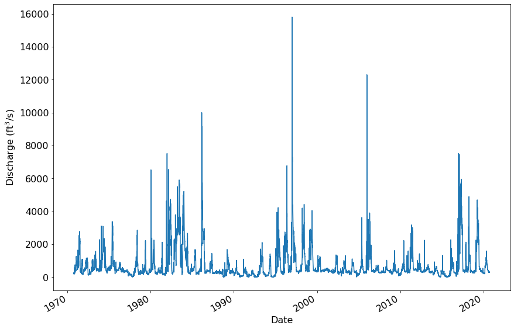
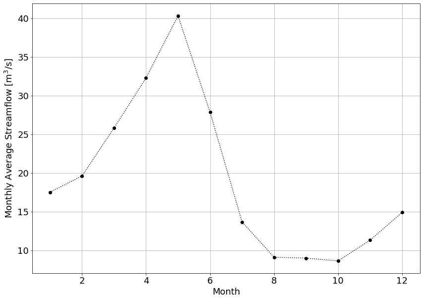
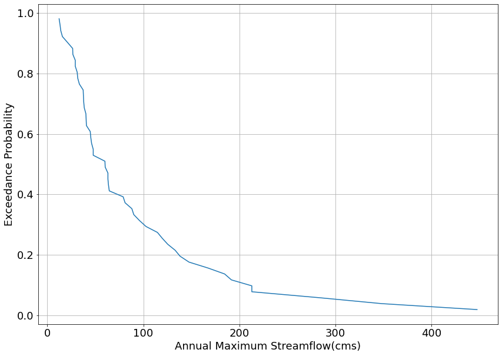

## CVU Open and Reproducible Research Computing (Fall 2022)

### Assignment Notebook: Time Series Analysis

#### 1. Install the `bmi_nwis` library (if it's not installed already)


```python
#!pip install bmi_nwis
```

#### 2. Import the libraries required for the assignment


```python
import numpy as np
import matplotlib.pyplot as plt
import pandas as pd
import dataretrieval.nwis as nwis

output_pkl_file = 'streamflow_data_'
```

#### 3a. Choose one of the following USGS stream gages to analyze

Uncomment __one__ of the following `site_id` variable declarations. Leave `my_start_date` and `my_end_date` unchanged. All of the sites below have at least 40 years of record. Only the Cache la Poudre has less than 50. 


```python
# site_id = '13185000' # Boise River at Twin Springs
# site_id = '13139510' # Big Wood River at Hailey
# site_id = '13246000' # North Fork of the Payette near Banks
# site_id = '13042500' # Henry's Fork Near Island Park
# site_id = '06752260' # Cache La Poudre River near Fort Collins (CO)
#site_id = '09085000' # Roaring Fork River at Glenwood Springs (CO)
site_id = '10348000' # TRUCKEE RIVER AT RENO, NV

my_start_date = '1970-10-01'
my_end_date = '2020-09-30'
```

#### 4. Get the Flow Data


```python
df_flow = nwis.get_record(sites=site_id, service='dv', 
                          start=my_start_date, end=my_end_date)
df_flow
```


<div>
<style scoped>
    .dataframe tbody tr th:only-of-type {
        vertical-align: middle;
    }

    .dataframe tbody tr th {
        vertical-align: top;
    }

    .dataframe thead th {
        text-align: right;
    }
</style>
<table border="1" class="dataframe">
  <thead>
    <tr style="text-align: right;">
      <th></th>
      <th>00010_Maximum</th>
      <th>00010_Maximum_cd</th>
      <th>site_no</th>
      <th>00010_Minimum</th>
      <th>00010_Minimum_cd</th>
      <th>00010_Mean</th>
      <th>00010_Mean_cd</th>
      <th>00060_Mean</th>
      <th>00060_Mean_cd</th>
    </tr>
    <tr>
      <th>datetime</th>
      <th></th>
      <th></th>
      <th></th>
      <th></th>
      <th></th>
      <th></th>
      <th></th>
      <th></th>
      <th></th>
    </tr>
  </thead>
  <tbody>
    <tr>
      <th>1970-10-01 00:00:00+00:00</th>
      <td>NaN</td>
      <td>NaN</td>
      <td>10348000</td>
      <td>NaN</td>
      <td>NaN</td>
      <td>NaN</td>
      <td>NaN</td>
      <td>229.0</td>
      <td>A</td>
    </tr>
    <tr>
      <th>1970-10-02 00:00:00+00:00</th>
      <td>NaN</td>
      <td>NaN</td>
      <td>10348000</td>
      <td>NaN</td>
      <td>NaN</td>
      <td>NaN</td>
      <td>NaN</td>
      <td>227.0</td>
      <td>A</td>
    </tr>
    <tr>
      <th>1970-10-03 00:00:00+00:00</th>
      <td>NaN</td>
      <td>NaN</td>
      <td>10348000</td>
      <td>NaN</td>
      <td>NaN</td>
      <td>NaN</td>
      <td>NaN</td>
      <td>218.0</td>
      <td>A</td>
    </tr>
    <tr>
      <th>1970-10-04 00:00:00+00:00</th>
      <td>NaN</td>
      <td>NaN</td>
      <td>10348000</td>
      <td>NaN</td>
      <td>NaN</td>
      <td>NaN</td>
      <td>NaN</td>
      <td>209.0</td>
      <td>A</td>
    </tr>
    <tr>
      <th>1970-10-05 00:00:00+00:00</th>
      <td>NaN</td>
      <td>NaN</td>
      <td>10348000</td>
      <td>NaN</td>
      <td>NaN</td>
      <td>NaN</td>
      <td>NaN</td>
      <td>212.0</td>
      <td>A</td>
    </tr>
    <tr>
      <th>...</th>
      <td>...</td>
      <td>...</td>
      <td>...</td>
      <td>...</td>
      <td>...</td>
      <td>...</td>
      <td>...</td>
      <td>...</td>
      <td>...</td>
    </tr>
    <tr>
      <th>2020-09-26 00:00:00+00:00</th>
      <td>NaN</td>
      <td>NaN</td>
      <td>10348000</td>
      <td>NaN</td>
      <td>NaN</td>
      <td>NaN</td>
      <td>NaN</td>
      <td>307.0</td>
      <td>A</td>
    </tr>
    <tr>
      <th>2020-09-27 00:00:00+00:00</th>
      <td>NaN</td>
      <td>NaN</td>
      <td>10348000</td>
      <td>NaN</td>
      <td>NaN</td>
      <td>NaN</td>
      <td>NaN</td>
      <td>334.0</td>
      <td>A</td>
    </tr>
    <tr>
      <th>2020-09-28 00:00:00+00:00</th>
      <td>NaN</td>
      <td>NaN</td>
      <td>10348000</td>
      <td>NaN</td>
      <td>NaN</td>
      <td>NaN</td>
      <td>NaN</td>
      <td>341.0</td>
      <td>A</td>
    </tr>
    <tr>
      <th>2020-09-29 00:00:00+00:00</th>
      <td>NaN</td>
      <td>NaN</td>
      <td>10348000</td>
      <td>NaN</td>
      <td>NaN</td>
      <td>NaN</td>
      <td>NaN</td>
      <td>331.0</td>
      <td>A</td>
    </tr>
    <tr>
      <th>2020-09-30 00:00:00+00:00</th>
      <td>NaN</td>
      <td>NaN</td>
      <td>10348000</td>
      <td>NaN</td>
      <td>NaN</td>
      <td>NaN</td>
      <td>NaN</td>
      <td>330.0</td>
      <td>A</td>
    </tr>
  </tbody>
</table>
<p>18262 rows × 9 columns</p>
</div>


#### 5. Plot the Data


```python
plt.rcParams.update({'font.size': 16})

ax1 = df_flow['00060_Mean'].plot(x='datetime', figsize=(14,10))

ax1.set_xlabel('Date')
ax1.set_ylabel('Discharge (ft${}^3$/s)')
```


    Text(0, 0.5, 'Discharge (ft${}^3$/s)')


    

    


#### 6. Wrangle the Data into a `pandas` DataFrame object

Steps: 
* Get the dates and streamflow out of the object returned by our call to `Nwis.nwis()`
* Convert the streamflow in ft${}^3$/s to m${}^3$/s
* Create a water year vector so we can analyze data by water year
* Create a `pandas.DataFrame()` with the data


```python
# Get the dates and convert them to a Pandas datetime object
dates = df_flow.index
dates = pd.DatetimeIndex(dates) 

# Get the streamflow in ft^3/s as a numerical array and create one that is the same values but in m^3/s
Q_cfs = df_flow['00060_Mean'].values
Q_cms = Q_cfs / (3.2808**3)

# Create a water year vector by getting the year for every streamflow observation, checking the 
# associated month of that observation and then – if that month is October (10) or onward – add
# 1 to the water year
WY = df_flow.index.year.values
WY[dates.month>=10] += 1

# Create a pandas DataFrame from these variables
df = pd.DataFrame()
df['Dates'] = dates
df['WaterYear'] = WY
df['Discharge_cfs'] = Q_cfs
df['Discharge_cms'] = Q_cms

# Rebuild the index to be able to use the pd.DataFrame.groupby() method
df.index = pd.to_datetime(df['Dates'],'%y-%m-%d')

# Save to a pickle file
# Question: What's going on with the file name? 
df.to_pickle(output_pkl_file+site_id+'.pkl')

# Show the dataframe we've created
df
```


<div>
<style scoped>
    .dataframe tbody tr th:only-of-type {
        vertical-align: middle;
    }

    .dataframe tbody tr th {
        vertical-align: top;
    }

    .dataframe thead th {
        text-align: right;
    }
</style>
<table border="1" class="dataframe">
  <thead>
    <tr style="text-align: right;">
      <th></th>
      <th>Dates</th>
      <th>WaterYear</th>
      <th>Discharge_cfs</th>
      <th>Discharge_cms</th>
    </tr>
    <tr>
      <th>Dates</th>
      <th></th>
      <th></th>
      <th></th>
      <th></th>
    </tr>
  </thead>
  <tbody>
    <tr>
      <th>1970-10-01 00:00:00+00:00</th>
      <td>1970-10-01 00:00:00+00:00</td>
      <td>1971</td>
      <td>229.0</td>
      <td>6.484794</td>
    </tr>
    <tr>
      <th>1970-10-02 00:00:00+00:00</th>
      <td>1970-10-02 00:00:00+00:00</td>
      <td>1971</td>
      <td>227.0</td>
      <td>6.428159</td>
    </tr>
    <tr>
      <th>1970-10-03 00:00:00+00:00</th>
      <td>1970-10-03 00:00:00+00:00</td>
      <td>1971</td>
      <td>218.0</td>
      <td>6.173298</td>
    </tr>
    <tr>
      <th>1970-10-04 00:00:00+00:00</th>
      <td>1970-10-04 00:00:00+00:00</td>
      <td>1971</td>
      <td>209.0</td>
      <td>5.918437</td>
    </tr>
    <tr>
      <th>1970-10-05 00:00:00+00:00</th>
      <td>1970-10-05 00:00:00+00:00</td>
      <td>1971</td>
      <td>212.0</td>
      <td>6.003390</td>
    </tr>
    <tr>
      <th>...</th>
      <td>...</td>
      <td>...</td>
      <td>...</td>
      <td>...</td>
    </tr>
    <tr>
      <th>2020-09-26 00:00:00+00:00</th>
      <td>2020-09-26 00:00:00+00:00</td>
      <td>2020</td>
      <td>307.0</td>
      <td>8.693589</td>
    </tr>
    <tr>
      <th>2020-09-27 00:00:00+00:00</th>
      <td>2020-09-27 00:00:00+00:00</td>
      <td>2020</td>
      <td>334.0</td>
      <td>9.458172</td>
    </tr>
    <tr>
      <th>2020-09-28 00:00:00+00:00</th>
      <td>2020-09-28 00:00:00+00:00</td>
      <td>2020</td>
      <td>341.0</td>
      <td>9.656397</td>
    </tr>
    <tr>
      <th>2020-09-29 00:00:00+00:00</th>
      <td>2020-09-29 00:00:00+00:00</td>
      <td>2020</td>
      <td>331.0</td>
      <td>9.373218</td>
    </tr>
    <tr>
      <th>2020-09-30 00:00:00+00:00</th>
      <td>2020-09-30 00:00:00+00:00</td>
      <td>2020</td>
      <td>330.0</td>
      <td>9.344900</td>
    </tr>
  </tbody>
</table>
<p>18262 rows × 4 columns</p>
</div>


#### 7. Compute the Seasonal Cycle and Plot


```python
q_seasonal = df['Discharge_cms'].groupby(by=df.index.month).mean().values

plt.figure(figsize=(14,10))
plt.rcParams.update({'font.size': 18}) # Increase the font size
plt.plot((np.arange(q_seasonal.size)+1),q_seasonal,'ko:')
plt.xlabel('Month')
plt.ylabel('Monthly Average Streamflow [m${}^3$/s]')
plt.grid()
plt.show()
```


    

    


## Instructions
---

1. Download this notebook into the folder for your repository for this module by opening a terminal window, navigating to your repository folder and issuing the command `curl -OL https://raw.githubusercontent.com/LejoFlores/OpenResearchComputing/main/mod02/mod02_assignment.ipynb`. Or, [click on this link](https://raw.githubusercontent.com/LejoFlores/OpenResearchComputing/main/mod02/mod02_assignment.ipynb) and save the page to your local repository.  
2. Verify that the notebook runs to this point 
3. Go back and change the `site_id` variable to a gage of your choosing by commenting out the current gage selected and uncommenting the gage you would like to investigate. Then in the Jupyter Lab menu go to "Kernel > Restart Kernel and Clear All Outputs" and click "Restart" when prompted
4. Re-run the notebook to this point
5. Now group the streamflow data by `WaterYear` and get the maximum streamflow value for each Water Year. You will need to use the `.groupby()` followed by the `.max()` methods. This should be very similar to the commands used to find the seasonal cycle above, but be sure to make sure to group by Water Year! Store the output of that operation in a variable called `Q_ams`. Print the output of `Q_ams` to see which years were associated with the lowest 5 and highest 5 annual maximum streamflows. __Note:__ See this [DataFrame.groupby()](https://www.geeksforgeeks.org/pandas-groupby/) and [DataFrame.max()](https://www.geeksforgeeks.org/python-pandas-dataframe-max/) documentation for help. 
6. Now sort the annual maximum series in ___descending order___ using the `.sort_values()` method. Use the `.values` to save these values to a numpy array. __Note:__ See this [DataFrame.sort_values()](https://www.geeksforgeeks.org/python-pandas-dataframe-sort_values-set-1/) and [DataFrame.values](https://www.geeksforgeeks.org/python-pandas-dataframe-values/) documentation for help. 
7. Compute the Weibull plotting position value for each streamflow value. The Weibull series is calculated using the formula:

    $$
    p_i = \frac{r_i}{n+1},
    $$

    where $r_i$ is the rank of the $i$th observation, $n$ is the number of annual maximum observations, and $p_i$ is the exceedance probability. Use the numpy command `np.arange()` method and the `.size` attribute on your annual maximum series array to create an array of ranks associated with each annual maximum value.
8. Create a presentation quality plot showing the annual maximum streamflows on the x-axis and the exceedance probability on the y axis. __Note:__ See this [numpy.arange()](https://numpy.org/doc/stable/reference/generated/numpy.arange.html) and [numpy.size()](https://numpy.org/doc/stable/reference/generated/numpy.broadcast.size.html) documentation for help. 
9. The $T$-year recurrence interval is associated with an exceedance probability of $p$ which is calculated using:

    $$ 
    p = \frac{1}{T} 
    $$

    Calculate the values of the 20- and 50- year recurrence interval events directly from the Weibull plotting position values by using the numpy `np.interp()` function, which does a very basic interpolation (there are more sophisticated ones, but this is sufficient for now). __Note:__ See this [numpy.interp()](https://www.geeksforgeeks.org/numpy-interp-function-python/) documentation for help.  


```python
Q_ams = df.groupby('WaterYear').max('Q_cms')
Q_ams
```


<div>
<style scoped>
    .dataframe tbody tr th:only-of-type {
        vertical-align: middle;
    }

    .dataframe tbody tr th {
        vertical-align: top;
    }

    .dataframe thead th {
        text-align: right;
    }
</style>
<table border="1" class="dataframe">
  <thead>
    <tr style="text-align: right;">
      <th></th>
      <th>Discharge_cfs</th>
      <th>Discharge_cms</th>
    </tr>
    <tr>
      <th>WaterYear</th>
      <th></th>
      <th></th>
    </tr>
  </thead>
  <tbody>
    <tr>
      <th>1971</th>
      <td>2790.0</td>
      <td>79.006884</td>
    </tr>
    <tr>
      <th>1972</th>
      <td>1180.0</td>
      <td>33.415098</td>
    </tr>
    <tr>
      <th>1973</th>
      <td>1580.0</td>
      <td>44.742250</td>
    </tr>
    <tr>
      <th>1974</th>
      <td>3110.0</td>
      <td>88.068606</td>
    </tr>
    <tr>
      <th>1975</th>
      <td>3390.0</td>
      <td>95.997612</td>
    </tr>
    <tr>
      <th>1976</th>
      <td>934.0</td>
      <td>26.448900</td>
    </tr>
    <tr>
      <th>1977</th>
      <td>469.0</td>
      <td>13.281086</td>
    </tr>
    <tr>
      <th>1978</th>
      <td>2860.0</td>
      <td>80.989136</td>
    </tr>
    <tr>
      <th>1979</th>
      <td>2230.0</td>
      <td>63.148872</td>
    </tr>
    <tr>
      <th>1980</th>
      <td>6520.0</td>
      <td>184.632575</td>
    </tr>
    <tr>
      <th>1981</th>
      <td>2130.0</td>
      <td>60.317084</td>
    </tr>
    <tr>
      <th>1982</th>
      <td>7520.0</td>
      <td>212.950455</td>
    </tr>
    <tr>
      <th>1983</th>
      <td>5910.0</td>
      <td>167.358669</td>
    </tr>
    <tr>
      <th>1984</th>
      <td>5210.0</td>
      <td>147.536153</td>
    </tr>
    <tr>
      <th>1985</th>
      <td>1690.0</td>
      <td>47.857217</td>
    </tr>
    <tr>
      <th>1986</th>
      <td>10000.0</td>
      <td>283.178796</td>
    </tr>
    <tr>
      <th>1987</th>
      <td>1440.0</td>
      <td>40.777747</td>
    </tr>
    <tr>
      <th>1988</th>
      <td>497.0</td>
      <td>14.073986</td>
    </tr>
    <tr>
      <th>1989</th>
      <td>1690.0</td>
      <td>47.857217</td>
    </tr>
    <tr>
      <th>1990</th>
      <td>1030.0</td>
      <td>29.167416</td>
    </tr>
    <tr>
      <th>1991</th>
      <td>1100.0</td>
      <td>31.149668</td>
    </tr>
    <tr>
      <th>1992</th>
      <td>436.0</td>
      <td>12.346596</td>
    </tr>
    <tr>
      <th>1993</th>
      <td>2120.0</td>
      <td>60.033905</td>
    </tr>
    <tr>
      <th>1994</th>
      <td>1420.0</td>
      <td>40.211389</td>
    </tr>
    <tr>
      <th>1995</th>
      <td>4230.0</td>
      <td>119.784631</td>
    </tr>
    <tr>
      <th>1996</th>
      <td>6770.0</td>
      <td>191.712045</td>
    </tr>
    <tr>
      <th>1997</th>
      <td>15800.0</td>
      <td>447.422498</td>
    </tr>
    <tr>
      <th>1998</th>
      <td>4430.0</td>
      <td>125.448207</td>
    </tr>
    <tr>
      <th>1999</th>
      <td>4050.0</td>
      <td>114.687412</td>
    </tr>
    <tr>
      <th>2000</th>
      <td>1330.0</td>
      <td>37.662780</td>
    </tr>
    <tr>
      <th>2001</th>
      <td>557.0</td>
      <td>15.773059</td>
    </tr>
    <tr>
      <th>2002</th>
      <td>1360.0</td>
      <td>38.512316</td>
    </tr>
    <tr>
      <th>2003</th>
      <td>1320.0</td>
      <td>37.379601</td>
    </tr>
    <tr>
      <th>2004</th>
      <td>1120.0</td>
      <td>31.716025</td>
    </tr>
    <tr>
      <th>2005</th>
      <td>3630.0</td>
      <td>102.793903</td>
    </tr>
    <tr>
      <th>2006</th>
      <td>12300.0</td>
      <td>348.309919</td>
    </tr>
    <tr>
      <th>2007</th>
      <td>747.0</td>
      <td>21.153456</td>
    </tr>
    <tr>
      <th>2008</th>
      <td>1030.0</td>
      <td>29.167416</td>
    </tr>
    <tr>
      <th>2009</th>
      <td>1630.0</td>
      <td>46.158144</td>
    </tr>
    <tr>
      <th>2010</th>
      <td>2230.0</td>
      <td>63.148872</td>
    </tr>
    <tr>
      <th>2011</th>
      <td>3180.0</td>
      <td>90.050857</td>
    </tr>
    <tr>
      <th>2012</th>
      <td>1430.0</td>
      <td>40.494568</td>
    </tr>
    <tr>
      <th>2013</th>
      <td>2250.0</td>
      <td>63.715229</td>
    </tr>
    <tr>
      <th>2014</th>
      <td>941.0</td>
      <td>26.647125</td>
    </tr>
    <tr>
      <th>2015</th>
      <td>1340.0</td>
      <td>37.945959</td>
    </tr>
    <tr>
      <th>2016</th>
      <td>2280.0</td>
      <td>64.564766</td>
    </tr>
    <tr>
      <th>2017</th>
      <td>7520.0</td>
      <td>212.950455</td>
    </tr>
    <tr>
      <th>2018</th>
      <td>4880.0</td>
      <td>138.191253</td>
    </tr>
    <tr>
      <th>2019</th>
      <td>4700.0</td>
      <td>133.094034</td>
    </tr>
    <tr>
      <th>2020</th>
      <td>1600.0</td>
      <td>45.308607</td>
    </tr>
  </tbody>
</table>
</div>


```python
Q_ams_sort = Q_ams.sort_values(by=['Discharge_cms'])
Q_ams_sort
```


<div>
<style scoped>
    .dataframe tbody tr th:only-of-type {
        vertical-align: middle;
    }

    .dataframe tbody tr th {
        vertical-align: top;
    }

    .dataframe thead th {
        text-align: right;
    }
</style>
<table border="1" class="dataframe">
  <thead>
    <tr style="text-align: right;">
      <th></th>
      <th>Discharge_cfs</th>
      <th>Discharge_cms</th>
    </tr>
    <tr>
      <th>WaterYear</th>
      <th></th>
      <th></th>
    </tr>
  </thead>
  <tbody>
    <tr>
      <th>1992</th>
      <td>436.0</td>
      <td>12.346596</td>
    </tr>
    <tr>
      <th>1977</th>
      <td>469.0</td>
      <td>13.281086</td>
    </tr>
    <tr>
      <th>1988</th>
      <td>497.0</td>
      <td>14.073986</td>
    </tr>
    <tr>
      <th>2001</th>
      <td>557.0</td>
      <td>15.773059</td>
    </tr>
    <tr>
      <th>2007</th>
      <td>747.0</td>
      <td>21.153456</td>
    </tr>
    <tr>
      <th>1976</th>
      <td>934.0</td>
      <td>26.448900</td>
    </tr>
    <tr>
      <th>2014</th>
      <td>941.0</td>
      <td>26.647125</td>
    </tr>
    <tr>
      <th>1990</th>
      <td>1030.0</td>
      <td>29.167416</td>
    </tr>
    <tr>
      <th>2008</th>
      <td>1030.0</td>
      <td>29.167416</td>
    </tr>
    <tr>
      <th>1991</th>
      <td>1100.0</td>
      <td>31.149668</td>
    </tr>
    <tr>
      <th>2004</th>
      <td>1120.0</td>
      <td>31.716025</td>
    </tr>
    <tr>
      <th>1972</th>
      <td>1180.0</td>
      <td>33.415098</td>
    </tr>
    <tr>
      <th>2003</th>
      <td>1320.0</td>
      <td>37.379601</td>
    </tr>
    <tr>
      <th>2000</th>
      <td>1330.0</td>
      <td>37.662780</td>
    </tr>
    <tr>
      <th>2015</th>
      <td>1340.0</td>
      <td>37.945959</td>
    </tr>
    <tr>
      <th>2002</th>
      <td>1360.0</td>
      <td>38.512316</td>
    </tr>
    <tr>
      <th>1994</th>
      <td>1420.0</td>
      <td>40.211389</td>
    </tr>
    <tr>
      <th>2012</th>
      <td>1430.0</td>
      <td>40.494568</td>
    </tr>
    <tr>
      <th>1987</th>
      <td>1440.0</td>
      <td>40.777747</td>
    </tr>
    <tr>
      <th>1973</th>
      <td>1580.0</td>
      <td>44.742250</td>
    </tr>
    <tr>
      <th>2020</th>
      <td>1600.0</td>
      <td>45.308607</td>
    </tr>
    <tr>
      <th>2009</th>
      <td>1630.0</td>
      <td>46.158144</td>
    </tr>
    <tr>
      <th>1989</th>
      <td>1690.0</td>
      <td>47.857217</td>
    </tr>
    <tr>
      <th>1985</th>
      <td>1690.0</td>
      <td>47.857217</td>
    </tr>
    <tr>
      <th>1993</th>
      <td>2120.0</td>
      <td>60.033905</td>
    </tr>
    <tr>
      <th>1981</th>
      <td>2130.0</td>
      <td>60.317084</td>
    </tr>
    <tr>
      <th>2010</th>
      <td>2230.0</td>
      <td>63.148872</td>
    </tr>
    <tr>
      <th>1979</th>
      <td>2230.0</td>
      <td>63.148872</td>
    </tr>
    <tr>
      <th>2013</th>
      <td>2250.0</td>
      <td>63.715229</td>
    </tr>
    <tr>
      <th>2016</th>
      <td>2280.0</td>
      <td>64.564766</td>
    </tr>
    <tr>
      <th>1971</th>
      <td>2790.0</td>
      <td>79.006884</td>
    </tr>
    <tr>
      <th>1978</th>
      <td>2860.0</td>
      <td>80.989136</td>
    </tr>
    <tr>
      <th>1974</th>
      <td>3110.0</td>
      <td>88.068606</td>
    </tr>
    <tr>
      <th>2011</th>
      <td>3180.0</td>
      <td>90.050857</td>
    </tr>
    <tr>
      <th>1975</th>
      <td>3390.0</td>
      <td>95.997612</td>
    </tr>
    <tr>
      <th>2005</th>
      <td>3630.0</td>
      <td>102.793903</td>
    </tr>
    <tr>
      <th>1999</th>
      <td>4050.0</td>
      <td>114.687412</td>
    </tr>
    <tr>
      <th>1995</th>
      <td>4230.0</td>
      <td>119.784631</td>
    </tr>
    <tr>
      <th>1998</th>
      <td>4430.0</td>
      <td>125.448207</td>
    </tr>
    <tr>
      <th>2019</th>
      <td>4700.0</td>
      <td>133.094034</td>
    </tr>
    <tr>
      <th>2018</th>
      <td>4880.0</td>
      <td>138.191253</td>
    </tr>
    <tr>
      <th>1984</th>
      <td>5210.0</td>
      <td>147.536153</td>
    </tr>
    <tr>
      <th>1983</th>
      <td>5910.0</td>
      <td>167.358669</td>
    </tr>
    <tr>
      <th>1980</th>
      <td>6520.0</td>
      <td>184.632575</td>
    </tr>
    <tr>
      <th>1996</th>
      <td>6770.0</td>
      <td>191.712045</td>
    </tr>
    <tr>
      <th>1982</th>
      <td>7520.0</td>
      <td>212.950455</td>
    </tr>
    <tr>
      <th>2017</th>
      <td>7520.0</td>
      <td>212.950455</td>
    </tr>
    <tr>
      <th>1986</th>
      <td>10000.0</td>
      <td>283.178796</td>
    </tr>
    <tr>
      <th>2006</th>
      <td>12300.0</td>
      <td>348.309919</td>
    </tr>
    <tr>
      <th>1997</th>
      <td>15800.0</td>
      <td>447.422498</td>
    </tr>
  </tbody>
</table>
</div>


```python
Q_ams_sort = Q_ams.sort_values(by=['Discharge_cms'], ascending=False).values
Q_ams_sort
```


    array([[1.58000000e+04, 4.47422498e+02],
           [1.23000000e+04, 3.48309919e+02],
           [1.00000000e+04, 2.83178796e+02],
           [7.52000000e+03, 2.12950455e+02],
           [7.52000000e+03, 2.12950455e+02],
           [6.77000000e+03, 1.91712045e+02],
           [6.52000000e+03, 1.84632575e+02],
           [5.91000000e+03, 1.67358669e+02],
           [5.21000000e+03, 1.47536153e+02],
           [4.88000000e+03, 1.38191253e+02],
           [4.70000000e+03, 1.33094034e+02],
           [4.43000000e+03, 1.25448207e+02],
           [4.23000000e+03, 1.19784631e+02],
           [4.05000000e+03, 1.14687412e+02],
           [3.63000000e+03, 1.02793903e+02],
           [3.39000000e+03, 9.59976119e+01],
           [3.18000000e+03, 9.00508572e+01],
           [3.11000000e+03, 8.80686056e+01],
           [2.86000000e+03, 8.09891357e+01],
           [2.79000000e+03, 7.90068841e+01],
           [2.28000000e+03, 6.45647655e+01],
           [2.25000000e+03, 6.37152291e+01],
           [2.23000000e+03, 6.31488715e+01],
           [2.23000000e+03, 6.31488715e+01],
           [2.13000000e+03, 6.03170836e+01],
           [2.12000000e+03, 6.00339048e+01],
           [1.69000000e+03, 4.78572166e+01],
           [1.69000000e+03, 4.78572166e+01],
           [1.63000000e+03, 4.61581438e+01],
           [1.60000000e+03, 4.53086074e+01],
           [1.58000000e+03, 4.47422498e+01],
           [1.44000000e+03, 4.07777466e+01],
           [1.43000000e+03, 4.04945679e+01],
           [1.42000000e+03, 4.02113891e+01],
           [1.36000000e+03, 3.85123163e+01],
           [1.34000000e+03, 3.79459587e+01],
           [1.33000000e+03, 3.76627799e+01],
           [1.32000000e+03, 3.73796011e+01],
           [1.18000000e+03, 3.34150979e+01],
           [1.12000000e+03, 3.17160252e+01],
           [1.10000000e+03, 3.11496676e+01],
           [1.03000000e+03, 2.91674160e+01],
           [1.03000000e+03, 2.91674160e+01],
           [9.41000000e+02, 2.66471247e+01],
           [9.34000000e+02, 2.64488996e+01],
           [7.47000000e+02, 2.11534561e+01],
           [5.57000000e+02, 1.57730589e+01],
           [4.97000000e+02, 1.40739862e+01],
           [4.69000000e+02, 1.32810855e+01],
           [4.36000000e+02, 1.23465955e+01]])


```python
Q_ams_sort = Q_ams.sort_values(by=['Discharge_cms'], ascending=False)
Q_ams_sort['rank'] = range(1,51)
Q_ams_sort
```


<div>
<style scoped>
    .dataframe tbody tr th:only-of-type {
        vertical-align: middle;
    }

    .dataframe tbody tr th {
        vertical-align: top;
    }

    .dataframe thead th {
        text-align: right;
    }
</style>
<table border="1" class="dataframe">
  <thead>
    <tr style="text-align: right;">
      <th></th>
      <th>Discharge_cfs</th>
      <th>Discharge_cms</th>
      <th>rank</th>
    </tr>
    <tr>
      <th>WaterYear</th>
      <th></th>
      <th></th>
      <th></th>
    </tr>
  </thead>
  <tbody>
    <tr>
      <th>1997</th>
      <td>15800.0</td>
      <td>447.422498</td>
      <td>1</td>
    </tr>
    <tr>
      <th>2006</th>
      <td>12300.0</td>
      <td>348.309919</td>
      <td>2</td>
    </tr>
    <tr>
      <th>1986</th>
      <td>10000.0</td>
      <td>283.178796</td>
      <td>3</td>
    </tr>
    <tr>
      <th>2017</th>
      <td>7520.0</td>
      <td>212.950455</td>
      <td>4</td>
    </tr>
    <tr>
      <th>1982</th>
      <td>7520.0</td>
      <td>212.950455</td>
      <td>5</td>
    </tr>
    <tr>
      <th>1996</th>
      <td>6770.0</td>
      <td>191.712045</td>
      <td>6</td>
    </tr>
    <tr>
      <th>1980</th>
      <td>6520.0</td>
      <td>184.632575</td>
      <td>7</td>
    </tr>
    <tr>
      <th>1983</th>
      <td>5910.0</td>
      <td>167.358669</td>
      <td>8</td>
    </tr>
    <tr>
      <th>1984</th>
      <td>5210.0</td>
      <td>147.536153</td>
      <td>9</td>
    </tr>
    <tr>
      <th>2018</th>
      <td>4880.0</td>
      <td>138.191253</td>
      <td>10</td>
    </tr>
    <tr>
      <th>2019</th>
      <td>4700.0</td>
      <td>133.094034</td>
      <td>11</td>
    </tr>
    <tr>
      <th>1998</th>
      <td>4430.0</td>
      <td>125.448207</td>
      <td>12</td>
    </tr>
    <tr>
      <th>1995</th>
      <td>4230.0</td>
      <td>119.784631</td>
      <td>13</td>
    </tr>
    <tr>
      <th>1999</th>
      <td>4050.0</td>
      <td>114.687412</td>
      <td>14</td>
    </tr>
    <tr>
      <th>2005</th>
      <td>3630.0</td>
      <td>102.793903</td>
      <td>15</td>
    </tr>
    <tr>
      <th>1975</th>
      <td>3390.0</td>
      <td>95.997612</td>
      <td>16</td>
    </tr>
    <tr>
      <th>2011</th>
      <td>3180.0</td>
      <td>90.050857</td>
      <td>17</td>
    </tr>
    <tr>
      <th>1974</th>
      <td>3110.0</td>
      <td>88.068606</td>
      <td>18</td>
    </tr>
    <tr>
      <th>1978</th>
      <td>2860.0</td>
      <td>80.989136</td>
      <td>19</td>
    </tr>
    <tr>
      <th>1971</th>
      <td>2790.0</td>
      <td>79.006884</td>
      <td>20</td>
    </tr>
    <tr>
      <th>2016</th>
      <td>2280.0</td>
      <td>64.564766</td>
      <td>21</td>
    </tr>
    <tr>
      <th>2013</th>
      <td>2250.0</td>
      <td>63.715229</td>
      <td>22</td>
    </tr>
    <tr>
      <th>1979</th>
      <td>2230.0</td>
      <td>63.148872</td>
      <td>23</td>
    </tr>
    <tr>
      <th>2010</th>
      <td>2230.0</td>
      <td>63.148872</td>
      <td>24</td>
    </tr>
    <tr>
      <th>1981</th>
      <td>2130.0</td>
      <td>60.317084</td>
      <td>25</td>
    </tr>
    <tr>
      <th>1993</th>
      <td>2120.0</td>
      <td>60.033905</td>
      <td>26</td>
    </tr>
    <tr>
      <th>1985</th>
      <td>1690.0</td>
      <td>47.857217</td>
      <td>27</td>
    </tr>
    <tr>
      <th>1989</th>
      <td>1690.0</td>
      <td>47.857217</td>
      <td>28</td>
    </tr>
    <tr>
      <th>2009</th>
      <td>1630.0</td>
      <td>46.158144</td>
      <td>29</td>
    </tr>
    <tr>
      <th>2020</th>
      <td>1600.0</td>
      <td>45.308607</td>
      <td>30</td>
    </tr>
    <tr>
      <th>1973</th>
      <td>1580.0</td>
      <td>44.742250</td>
      <td>31</td>
    </tr>
    <tr>
      <th>1987</th>
      <td>1440.0</td>
      <td>40.777747</td>
      <td>32</td>
    </tr>
    <tr>
      <th>2012</th>
      <td>1430.0</td>
      <td>40.494568</td>
      <td>33</td>
    </tr>
    <tr>
      <th>1994</th>
      <td>1420.0</td>
      <td>40.211389</td>
      <td>34</td>
    </tr>
    <tr>
      <th>2002</th>
      <td>1360.0</td>
      <td>38.512316</td>
      <td>35</td>
    </tr>
    <tr>
      <th>2015</th>
      <td>1340.0</td>
      <td>37.945959</td>
      <td>36</td>
    </tr>
    <tr>
      <th>2000</th>
      <td>1330.0</td>
      <td>37.662780</td>
      <td>37</td>
    </tr>
    <tr>
      <th>2003</th>
      <td>1320.0</td>
      <td>37.379601</td>
      <td>38</td>
    </tr>
    <tr>
      <th>1972</th>
      <td>1180.0</td>
      <td>33.415098</td>
      <td>39</td>
    </tr>
    <tr>
      <th>2004</th>
      <td>1120.0</td>
      <td>31.716025</td>
      <td>40</td>
    </tr>
    <tr>
      <th>1991</th>
      <td>1100.0</td>
      <td>31.149668</td>
      <td>41</td>
    </tr>
    <tr>
      <th>1990</th>
      <td>1030.0</td>
      <td>29.167416</td>
      <td>42</td>
    </tr>
    <tr>
      <th>2008</th>
      <td>1030.0</td>
      <td>29.167416</td>
      <td>43</td>
    </tr>
    <tr>
      <th>2014</th>
      <td>941.0</td>
      <td>26.647125</td>
      <td>44</td>
    </tr>
    <tr>
      <th>1976</th>
      <td>934.0</td>
      <td>26.448900</td>
      <td>45</td>
    </tr>
    <tr>
      <th>2007</th>
      <td>747.0</td>
      <td>21.153456</td>
      <td>46</td>
    </tr>
    <tr>
      <th>2001</th>
      <td>557.0</td>
      <td>15.773059</td>
      <td>47</td>
    </tr>
    <tr>
      <th>1988</th>
      <td>497.0</td>
      <td>14.073986</td>
      <td>48</td>
    </tr>
    <tr>
      <th>1977</th>
      <td>469.0</td>
      <td>13.281086</td>
      <td>49</td>
    </tr>
    <tr>
      <th>1992</th>
      <td>436.0</td>
      <td>12.346596</td>
      <td>50</td>
    </tr>
  </tbody>
</table>
</div>


```python
Q_ams_sort['pi'] = Q_ams_sort['rank'] / (len(Q_ams_int) + 1)
Q_ams_sort['pi'] = round(Q_ams_sort['pi'],2)
#I was having a hard time getting the np.arrange() function to work, so I used a go-around method
#my usual programming language is R, I keep getting confused about python syntax
```


<div>
<style scoped>
    .dataframe tbody tr th:only-of-type {
        vertical-align: middle;
    }

    .dataframe tbody tr th {
        vertical-align: top;
    }

    .dataframe thead th {
        text-align: right;
    }
</style>
<table border="1" class="dataframe">
  <thead>
    <tr style="text-align: right;">
      <th></th>
      <th>Discharge_cfs</th>
      <th>Discharge_cms</th>
      <th>rank</th>
      <th>pi</th>
    </tr>
    <tr>
      <th>WaterYear</th>
      <th></th>
      <th></th>
      <th></th>
      <th></th>
    </tr>
  </thead>
  <tbody>
    <tr>
      <th>1997</th>
      <td>15800.0</td>
      <td>447.422498</td>
      <td>1</td>
      <td>0.02</td>
    </tr>
    <tr>
      <th>2006</th>
      <td>12300.0</td>
      <td>348.309919</td>
      <td>2</td>
      <td>0.04</td>
    </tr>
    <tr>
      <th>1986</th>
      <td>10000.0</td>
      <td>283.178796</td>
      <td>3</td>
      <td>0.06</td>
    </tr>
    <tr>
      <th>2017</th>
      <td>7520.0</td>
      <td>212.950455</td>
      <td>4</td>
      <td>0.08</td>
    </tr>
    <tr>
      <th>1982</th>
      <td>7520.0</td>
      <td>212.950455</td>
      <td>5</td>
      <td>0.10</td>
    </tr>
    <tr>
      <th>1996</th>
      <td>6770.0</td>
      <td>191.712045</td>
      <td>6</td>
      <td>0.12</td>
    </tr>
    <tr>
      <th>1980</th>
      <td>6520.0</td>
      <td>184.632575</td>
      <td>7</td>
      <td>0.14</td>
    </tr>
    <tr>
      <th>1983</th>
      <td>5910.0</td>
      <td>167.358669</td>
      <td>8</td>
      <td>0.16</td>
    </tr>
    <tr>
      <th>1984</th>
      <td>5210.0</td>
      <td>147.536153</td>
      <td>9</td>
      <td>0.18</td>
    </tr>
    <tr>
      <th>2018</th>
      <td>4880.0</td>
      <td>138.191253</td>
      <td>10</td>
      <td>0.20</td>
    </tr>
    <tr>
      <th>2019</th>
      <td>4700.0</td>
      <td>133.094034</td>
      <td>11</td>
      <td>0.22</td>
    </tr>
    <tr>
      <th>1998</th>
      <td>4430.0</td>
      <td>125.448207</td>
      <td>12</td>
      <td>0.24</td>
    </tr>
    <tr>
      <th>1995</th>
      <td>4230.0</td>
      <td>119.784631</td>
      <td>13</td>
      <td>0.25</td>
    </tr>
    <tr>
      <th>1999</th>
      <td>4050.0</td>
      <td>114.687412</td>
      <td>14</td>
      <td>0.27</td>
    </tr>
    <tr>
      <th>2005</th>
      <td>3630.0</td>
      <td>102.793903</td>
      <td>15</td>
      <td>0.29</td>
    </tr>
    <tr>
      <th>1975</th>
      <td>3390.0</td>
      <td>95.997612</td>
      <td>16</td>
      <td>0.31</td>
    </tr>
    <tr>
      <th>2011</th>
      <td>3180.0</td>
      <td>90.050857</td>
      <td>17</td>
      <td>0.33</td>
    </tr>
    <tr>
      <th>1974</th>
      <td>3110.0</td>
      <td>88.068606</td>
      <td>18</td>
      <td>0.35</td>
    </tr>
    <tr>
      <th>1978</th>
      <td>2860.0</td>
      <td>80.989136</td>
      <td>19</td>
      <td>0.37</td>
    </tr>
    <tr>
      <th>1971</th>
      <td>2790.0</td>
      <td>79.006884</td>
      <td>20</td>
      <td>0.39</td>
    </tr>
    <tr>
      <th>2016</th>
      <td>2280.0</td>
      <td>64.564766</td>
      <td>21</td>
      <td>0.41</td>
    </tr>
    <tr>
      <th>2013</th>
      <td>2250.0</td>
      <td>63.715229</td>
      <td>22</td>
      <td>0.43</td>
    </tr>
    <tr>
      <th>1979</th>
      <td>2230.0</td>
      <td>63.148872</td>
      <td>23</td>
      <td>0.45</td>
    </tr>
    <tr>
      <th>2010</th>
      <td>2230.0</td>
      <td>63.148872</td>
      <td>24</td>
      <td>0.47</td>
    </tr>
    <tr>
      <th>1981</th>
      <td>2130.0</td>
      <td>60.317084</td>
      <td>25</td>
      <td>0.49</td>
    </tr>
    <tr>
      <th>1993</th>
      <td>2120.0</td>
      <td>60.033905</td>
      <td>26</td>
      <td>0.51</td>
    </tr>
    <tr>
      <th>1985</th>
      <td>1690.0</td>
      <td>47.857217</td>
      <td>27</td>
      <td>0.53</td>
    </tr>
    <tr>
      <th>1989</th>
      <td>1690.0</td>
      <td>47.857217</td>
      <td>28</td>
      <td>0.55</td>
    </tr>
    <tr>
      <th>2009</th>
      <td>1630.0</td>
      <td>46.158144</td>
      <td>29</td>
      <td>0.57</td>
    </tr>
    <tr>
      <th>2020</th>
      <td>1600.0</td>
      <td>45.308607</td>
      <td>30</td>
      <td>0.59</td>
    </tr>
    <tr>
      <th>1973</th>
      <td>1580.0</td>
      <td>44.742250</td>
      <td>31</td>
      <td>0.61</td>
    </tr>
    <tr>
      <th>1987</th>
      <td>1440.0</td>
      <td>40.777747</td>
      <td>32</td>
      <td>0.63</td>
    </tr>
    <tr>
      <th>2012</th>
      <td>1430.0</td>
      <td>40.494568</td>
      <td>33</td>
      <td>0.65</td>
    </tr>
    <tr>
      <th>1994</th>
      <td>1420.0</td>
      <td>40.211389</td>
      <td>34</td>
      <td>0.67</td>
    </tr>
    <tr>
      <th>2002</th>
      <td>1360.0</td>
      <td>38.512316</td>
      <td>35</td>
      <td>0.69</td>
    </tr>
    <tr>
      <th>2015</th>
      <td>1340.0</td>
      <td>37.945959</td>
      <td>36</td>
      <td>0.71</td>
    </tr>
    <tr>
      <th>2000</th>
      <td>1330.0</td>
      <td>37.662780</td>
      <td>37</td>
      <td>0.73</td>
    </tr>
    <tr>
      <th>2003</th>
      <td>1320.0</td>
      <td>37.379601</td>
      <td>38</td>
      <td>0.75</td>
    </tr>
    <tr>
      <th>1972</th>
      <td>1180.0</td>
      <td>33.415098</td>
      <td>39</td>
      <td>0.76</td>
    </tr>
    <tr>
      <th>2004</th>
      <td>1120.0</td>
      <td>31.716025</td>
      <td>40</td>
      <td>0.78</td>
    </tr>
    <tr>
      <th>1991</th>
      <td>1100.0</td>
      <td>31.149668</td>
      <td>41</td>
      <td>0.80</td>
    </tr>
    <tr>
      <th>1990</th>
      <td>1030.0</td>
      <td>29.167416</td>
      <td>42</td>
      <td>0.82</td>
    </tr>
    <tr>
      <th>2008</th>
      <td>1030.0</td>
      <td>29.167416</td>
      <td>43</td>
      <td>0.84</td>
    </tr>
    <tr>
      <th>2014</th>
      <td>941.0</td>
      <td>26.647125</td>
      <td>44</td>
      <td>0.86</td>
    </tr>
    <tr>
      <th>1976</th>
      <td>934.0</td>
      <td>26.448900</td>
      <td>45</td>
      <td>0.88</td>
    </tr>
    <tr>
      <th>2007</th>
      <td>747.0</td>
      <td>21.153456</td>
      <td>46</td>
      <td>0.90</td>
    </tr>
    <tr>
      <th>2001</th>
      <td>557.0</td>
      <td>15.773059</td>
      <td>47</td>
      <td>0.92</td>
    </tr>
    <tr>
      <th>1988</th>
      <td>497.0</td>
      <td>14.073986</td>
      <td>48</td>
      <td>0.94</td>
    </tr>
    <tr>
      <th>1977</th>
      <td>469.0</td>
      <td>13.281086</td>
      <td>49</td>
      <td>0.96</td>
    </tr>
    <tr>
      <th>1992</th>
      <td>436.0</td>
      <td>12.346596</td>
      <td>50</td>
      <td>0.98</td>
    </tr>
  </tbody>
</table>
</div>


```python
plt.figure(figsize=(14,10))
plt.rcParams.update({'font.size': 18}) # Increase the font size
plt.plot(Q_ams_sort['Discharge_cms'],Q_ams_sort['pi'])
plt.xlabel('Annual Maximum Streamflow (cms)')
plt.ylabel('Exceedance Probability')
plt.grid()
plt.show()
```


    

    


```python
#twenty year flood p
twentyyf = (1-(1-0.05)**50)
twentyyf_r =round(twentyyf,1)


#fifty year flood p
fiftyyf = (1-(1-0.02)**50)
fiftyyf_r =round(fiftyyf,2)

```


```python
twenty_cms =(Q_ams_sort['pi'] >= twentyyf_r, Q_ams_sort['Discharge_cms'])
twenty_cms
##true starting in 2001 on ranked list, corresponding discharge of 15.773 cms
Q20 = 15.773

fifty_cms =(Q_ams_sort['pi'] >= fiftyyf_r, Q_ams_sort['Discharge_cms'])
fifty_cms
##true starting in 2012 on ranked list, corresponding discharge of 40.495 cms 
Q50 = 40.495
```


```python
print('The 20-year flood event has a magnitude of {:.3f} m^3/s'.format(Q20))
print('The 50-year flood event has a magnitude of {:.3f} m^3/s'.format(Q50))
```

    The 20-year flood event has a magnitude of 15.773 m^3/s
    The 50-year flood event has a magnitude of 40.495 m^3/s


##I had a really hard time with python syntax - I knew what I needed to do and could think about how to do it in R but then could not figure out how to translate those functions into python syntax, even after reading through the documentation files and searching stack overflow. The code I ended up with is not very efficient and doesn't use some of the functions you requested in this assignment -- sorry for the work-arounds it is the only way I could figure out how to get the requested results.
